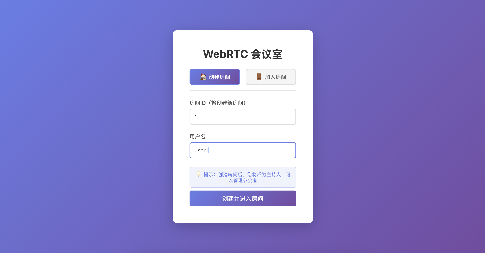
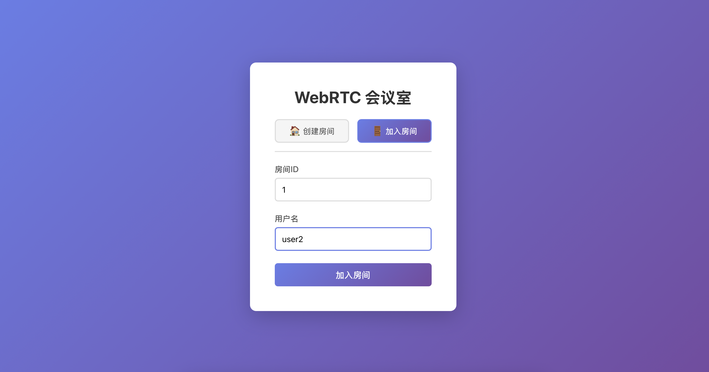
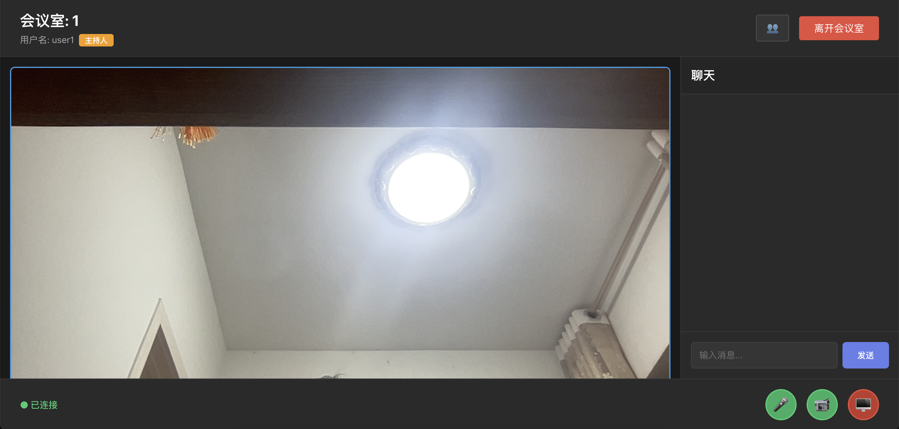
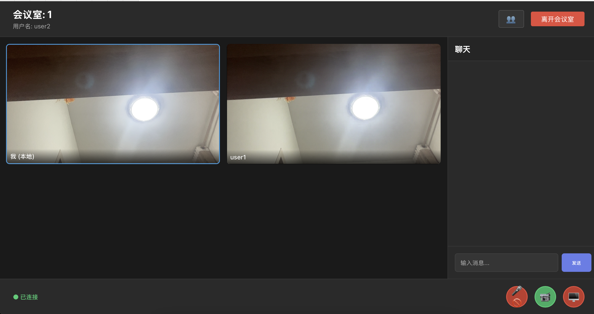
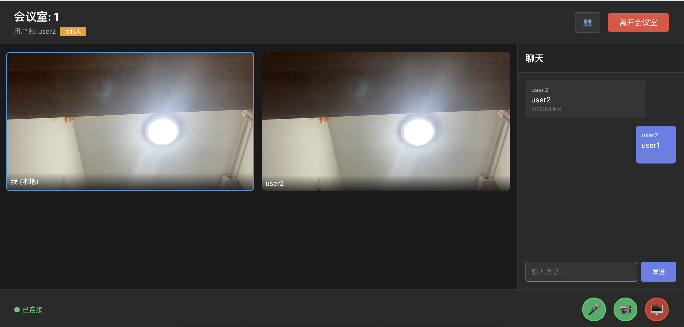
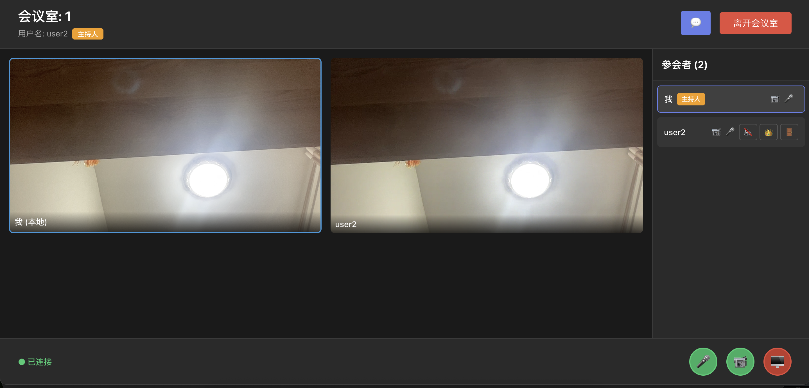
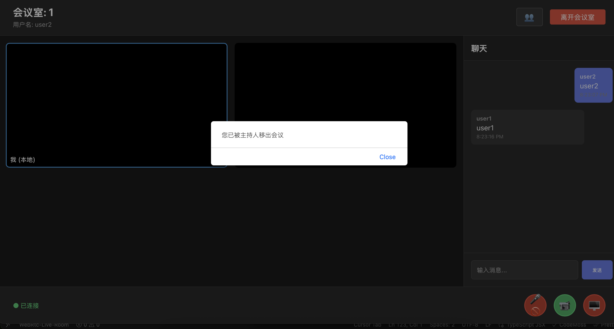

# WebRTC Live Room - 实时视频会议室

基于 React + TypeScript + Redux + WebRTC + WebSocket 的实时视频会议室系统，支持多人视频通话、屏幕共享和文字聊天。

## 功能特性

### 核心功能
- ✅ 多人实时视频通话（WebRTC P2P 连接）
- ✅ 屏幕共享
- ✅ 实时文字聊天
- ✅ 音视频开关控制
- ✅ 参会者列表展示
- ✅ 参会者音视频状态显示
- ✅ 主持人功能（创建房间者为主持人）
- ✅ 静音/踢出/转让主持人权限
- ✅ 网络质量指示器（UI 已就绪）

### 技术栈

**前端**
- React 18 + TypeScript
- Redux Toolkit（状态管理）
- WebRTC API（音视频通信）
- WebSocket（信令传输）

**后端**
- Spring Boot 2.x
- Spring WebSocket（WebSocket 服务器）
- Jackson（JSON 序列化）

## 界面展示


*图1: 创建或加入会议室界面*


*图2: 会议室主界面，显示本地和远程视频流*


*图3: 多人视频通话界面*


*图4: 参会者列表，显示音视频状态和主持人标识*


*图5: 音视频控制和屏幕共享功能*


*图6: 实时文字聊天功能*


*图7: 主持人权限管理（静音、踢出、转让主持人）*

## 项目结构

```
WebRtc-Live-Room/
├── frontend/              # React 前端应用
│   ├── src/
│   │   ├── components/    # React 组件
│   │   │   ├── Room.tsx           # 会议室主组件
│   │   │   ├── VideoGrid.tsx      # 视频网格布局
│   │   │   ├── ChatPanel.tsx      # 聊天面板
│   │   │   ├── ControlBar.tsx     # 控制栏
│   │   │   ├── JoinRoom.tsx       # 加入房间组件
│   │   │   └── ParticipantsList.tsx  # 参会者列表
│   │   ├── hooks/
│   │   │   └── useWebRTC.ts       # WebRTC 核心逻辑 Hook
│   │   ├── store/                 # Redux 状态管理
│   │   │   ├── slices/
│   │   │   │   ├── roomSlice.ts   # 房间状态
│   │   │   │   └── webrtcSlice.ts # WebRTC 状态
│   │   │   ├── hooks.ts           # Redux 类型化 Hooks
│   │   │   └── index.ts           # Store 配置
│   │   ├── types/                 # TypeScript 类型定义
│   │   └── App.tsx
│   └── package.json
├── backend/               # Spring Boot 后端
│   ├── src/main/java/com/webrtc/liveroom/
│   │   ├── WebRtcLiveRoomApplication.java
│   │   ├── config/
│   │   │   ├── WebSocketConfig.java    # WebSocket 配置
│   │   │   └── CorsConfig.java         # CORS 配置
│   │   ├── handler/
│   │   │   └── SignalingHandler.java   # WebSocket 消息处理
│   │   ├── service/
│   │   │   └── RoomService.java        # 房间管理服务
│   │   └── model/
│   │       └── Message.java            # 消息模型
│   └── pom.xml
└── README.md

```

## 快速开始

### 环境要求
- Node.js 16+
- Java 11+ 和 Maven 3.6+
- 现代浏览器（支持 WebRTC）

### 启动后端

```bash
cd backend
mvn spring-boot:run
```

后端默认运行在 `http://localhost:8080`

### 启动前端

```bash
cd frontend
npm install
npm start
```

前端默认运行在 `http://localhost:3000`

## 使用说明

1. **创建/加入会议室**
   - 可以选择创建新房间或加入已有房间
   - 输入房间 ID 和用户名
   - 点击"创建并进入房间"或"加入会议室"

2. **视频通话**
   - 点击控制栏的摄像头图标开启/关闭视频
   - 点击麦克风图标开启/关闭音频
   - 点击屏幕共享图标开始/停止共享屏幕

3. **聊天功能**
   - 在右侧聊天面板输入消息
   - 按 Enter 发送消息

4. **参会者管理**
   - 点击右上角的参会者图标（👥）查看参会者列表
   - 查看每个参会者的音视频状态和网络质量
   - 主持人可以静音、踢出用户或转让主持人权限

## WebRTC 连接流程

1. **加入房间**
   - 前端通过 WebSocket 发送 `join` 或 `create-room` 消息
   - 后端返回现有用户列表和加入成功消息

2. **建立 P2P 连接**
   - 使用用户 ID 比较决定谁创建 offer（较小 ID 创建，避免竞态条件）
   - 创建 PeerConnection 并交换 SDP offer/answer
   - 交换 ICE candidates 建立连接

3. **媒体流传输**
   - 本地流通过 `addTrack` 添加到 PeerConnection
   - 远程流通过 `ontrack` 事件接收
   - 实时更新到视频网格组件

## 企业级功能

- **参会者列表**：显示所有参会者及其音视频状态
- **主持人功能**：创建房间者自动成为主持人
- **权限控制**：主持人可以静音、踢出用户
- **主持人转让**：主持人可以将权限转让给其他用户
- **状态同步**：实时同步所有用户的音视频状态

## 开发说明

### 状态管理架构

- **Redux Store**：存储可序列化的状态（房间信息、消息、用户列表等）
- **React Refs**：存储不可序列化的对象（MediaStream、RTCPeerConnection、WebSocket 等）

### WebRTC 关键实现

- 使用 STUN 服务器进行 NAT 穿透
- 通过用户 ID 比较实现确定性的 offer 创建，避免竞态条件
- 使用 `useState` 管理远程流，确保 React 正确检测到变化并重新渲染

### 类型安全

- 所有组件和 Hooks 使用 TypeScript 编写
- 使用 Redux Toolkit 的类型化 Actions 和 Selectors
- 完整的类型定义在 `src/types/index.ts`

## 技术支持

如有任何问题或建议，欢迎联系：

📧 邮箱: 1045723701@qq.com  
💬 QQ: 1045723701

也欢迎添加 QQ 好友进行技术交流。

## 项目合作

有任何项目需求和合作欢迎联系：

✅ 可以个性化定制  
✅ 长期接单中

无论是功能定制、UI 设计调整，还是完整的项目开发，都可以根据您的需求进行个性化定制。欢迎通过邮箱或 QQ 联系洽谈合作事宜。

## License

MIT
